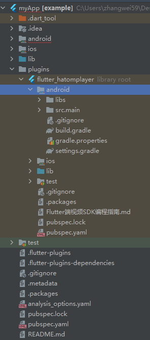
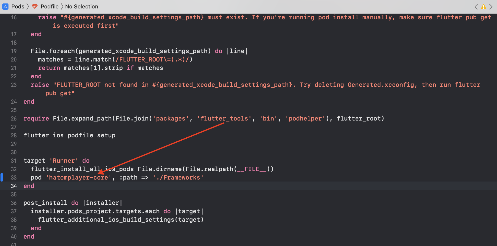
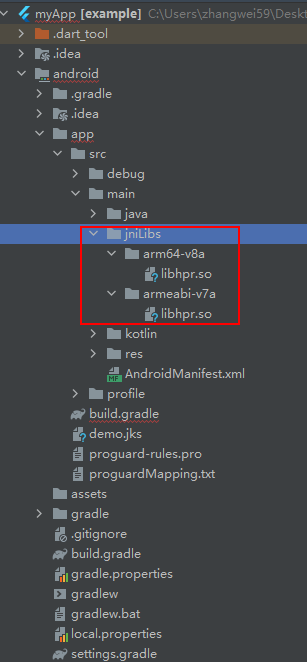
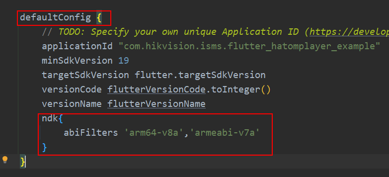

## 1.SDK 简介

- SDK 的主要功能包括：监控点预览、回放、语⾳对讲相关功能
- 开发者拿到的 SDK 压缩⽂件，解压后包括《Flutter 端视频 SDK 编程指南》⽂档⼀份、flutter_hatomplayer 示例 Demo ⼀ 份。Demo 仅作为示例，旨在直观的展示 SDK 的功能，界⾯较为简单，界⾯的实现不在本⽂档解释，请 开发者参考 demo 中的示例代码及注释开发⾃⼰的界⾯和程序。请开发者认真阅读本⽂档，以便于顺利 进⾏ SDK 的接⼊和开发⼯作。
- 环境要求：

  **Flutter:**

  ```dart
  environment:
  sdk: ">=2.12.1<3.0.0"
  flutter: ">=2.5.0"
  ```

  **iOS:**

  Xcode12，iOS11 以上

  **Android：**

  Android Studio 4.0.1 版本及以上，Android 4.4 及以上

- 注意事项：此 SDK 只⽀持真机调试，不⽀持模拟器调试。

## 2.更新说明

### 2.1 Version 1.1.1(build20240116)

- Andorid升级HPSClient到V5.11.19_build20230821-SNAPSHOT，iOS升级HPSClient升级到V5.11.9_ios_openssl1.1.1w;
- OpenSSL升级到1.1.1w;
- 修改水印展示开启逻辑，有水印信息时才开启；

### 2.2 Version 1.1.0(build20230706)

- 修复了 openssl 问题。

### 2.3 Version 1.0.0(build20221008)

- ⽀持监控点的预览、回放、语⾳对讲功能。
- ⽀持播放过程中抓图、声⾳控制、本地录像、倍速回放功能。
- ⽀持播放本地录像⽂件功能。
- ⽀持软硬解码、智能信息展示设置（目前仅 Android 支持）。


## 3.快速集成

本次 SDK 提供了 `flutter_hatomplayer插件` 和插件的集成使⽤简单⼯程 flutter_hatomplayer 示例 Demo。 Demo 提供预览、回放、语⾳对讲等核⼼功能。

### 3.1 SDK 导入

由于目前未发布到官方仓上，只能本地引入。

在自己的 Flutter 项目中，创建`Plugins`文件夹，再复制整个`flutter_hatomplayer`插件文件到创建的 Plugin 文件夹中目录中，删除一些无用文件夹，截图中的文件夹需要保留：



在项目中的`pubspec.yaml`文件中添加依赖：

```dart
dependencies:
  flutter_hatomplayer:
    path: plugins/flutter_hatomplayer
```

### 3.2 工程配置

由于插件依赖于原生 SDK，因此以下分别是 iOS 和 Android 端导入原生 SDK 方式。

- iOS

    1.  在 Flutter 示例 demo 的`example/ios/Frameworks`文件夹中，可查看到`hatomplayer_core.framework`以及`hatomplayer-core.podspec`两个文件，在`example/ios/Podfile`中，需要将该 framework 进行引入，引入方式如下图所示：

        

    1.  在 Build Settings 中将 Enable Bitcode 关闭。
    1.  在 Info 中添加隐私权限(对讲需要开启⻨克⻛)。

- Android

    1.  导入示例 demo 的`example/android/app/src/main/jniLibs`文件夹中的 so 库文件到自己创建的 Flutter 项目的 android 工程中的相同位置：
        
    2.  到自己创建的 Flutter 项目的 android 工程中的 app 模块的`build.gradle`文件中配置 NDK 文件夹：
        `java ndk{ abiFilters 'arm64-v8a','armeabi-v7a' } `
        
        _注意_： 由于 Android 官方已不再支持生成 ABI 为:'armeabi'的 so 库，因此海康威视不再提供'armeabi'的
        so 库。如果您的项目中引用了其他三方'armeabi'的 so 库，可以将'armeabi'的 so 库直接置于'armeabi-v7a'中。如果您的项目中存在多种 ABI 文件夹，例如同时存在'armeabi'和'armeabi-v7a'文件夹，您必须保证项目中的各个 ABI 文件夹都有一份相应 ABI 格式的 so 库。建议您只需要保留 ABI 为'armeabi-v7a'的 so 即可。arm64-v8a 同理。

    3.  到自己创建的 Flutter 项目的 android 工程中的 app 模块的`build.gradle`文件中配置混淆，混淆文件参考示例 demo 的`example/android/app`文件夹中的`proguard-rules.pro`文件：
        ```java
            buildTypes {
                release {
                    //是否zip对齐
                    zipAlignEnabled true
                    // 缩减resource文件
                    shrinkResources false
                    //Proguard
                    minifyEnabled true
                    debuggable false
                    proguardFiles getDefaultProguardFile('proguard-android.txt'), 'proguard-rules.pro'
                    //签名
                    signingConfig signingConfigs.config
                }
                debug {
                    //给applicationId添加后缀“.debug”
                    applicationIdSuffix ".debug"
                    buildConfigField "boolean", "LOG_DEBUG", "true"
                    zipAlignEnabled false
                    shrinkResources false
                    minifyEnabled false
                    debuggable true
                }
            }
        ```

### 3.3 初始化

#### 3.3.1 导入头文件

```dart
import 'package:flutter_hatomplayer/flutter_hatomplayer.dart';
```

#### 3.3.2 初始化播放器

```dart
FlutterHatomplayer player = FlutterHatomplayer(
        playConfig: playConfig,
        urlPath: urlPath,
        headers: headers,
        playEventCallBack: (event) {}
await player.initialize()
```

## 4.视频核心功能使用

### 4.1 使用流程说明

#### 4.1.1 实时预览

实时预览功能可以实时查看摄像机的监控画⾯，从⽽进⾏实时监控。本节对实时预览的接⼊流程进⾏详细说明，接⼝调⽤流程如下图所示：

```dart
// 播放前设置播放配置（可选）
PlayConfig playConfig = PlayConfig(hardDecode: true, privateData: false);
// 设置播放参数（可选）
Map<String, dynamic> headers = {'token': ''};
// urlPath为短链接，需要通过调⽤openApi获取
String urlPath = '';
// 初始化播放器
FlutterHatomplayer player = FlutterHatomplayer(
        playConfig: playConfig,
        urlPath: urlPath,
        headers: headers,
        playEventCallBack: (event) {
            //播放结果回调event：EVENT_PLAY_SUCCESS（播放成功）、EVENT_PLAY_ERROR（播放失败）、EVENT_UNKNOWN（未知异常)、EVENT_PLAY_FINISH（播放结束）
        }
await player.initialize();
// 开启预览
await player.start();
// 关闭预览
await player.stop();

```

#### 4.1.2 网络录像回放

本节对录像回放的接⼊流程进⾏详细说明，接⼝调⽤流程如下图所示：

```dart
// 播放前设置播放配置（可选）
PlayConfig playConfig = PlayConfig(hardDecode: true, privateData: false);
// 设置播放参数
// 开始时间，必传，yyyy-MM-dd'T'HH:mm:ss.SSS+08:00时间格式
String startTime = '${startDate.toIso8601String()}+08:00';
// 结束时间，必传，yyyy-MM-dd'T'HH:mm:ss.SSS+08:00时间格式
String endTime = '${endDate.toIso8601String()}+08:00';
Map<String, dynamic> headers = {
      'token': '',
      'startTime': startTime,
      'endTime': endTime
    };
// urlPath为短链接，需要通过调⽤openApi获取
String urlPath = '';
// 初始化播放器
FlutterHatomplayer player = FlutterHatomplayer(
        playConfig: playConfig,
        urlPath: urlPath,
        headers: headers,
        playEventCallBack: (event) {
            //播放结果回调event：EVENT_PLAY_SUCCESS（播放成功）、EVENT_PLAY_ERROR（播放失败）、EVENT_UNKNOWN（未知异常)、EVENT_PLAY_FINISH（播放结束）
        }
await player.initialize();
// 开启预览
await player.start();
// 关闭预览
await player.stop();

```

#### 4.1.3 语音对讲

本节对语⾳对讲的接⼊流程进⾏详细说明，接⼝调⽤流程如下图所示：

```dart
// 初始化播放器
FlutterHatomplayer player = FlutterHatomplayer(
        playEventCallBack: (event) {
        //对讲结果回调event：EVENT_TALK_SUCCESS（播放成功）、EVENT_TALK_ERROR（对讲失败）
        }
await player.initialize();
// 设置对讲参数（可选）
Map<String, dynamic> headers = {'token': ''};
// talkUrl为短链接，需要通过调⽤openApi获取
String talkUrl = '';
// 设置对讲url
await player.setVoiceDataSource(talkUrl, headers: headers);
// 开启对讲
await player.startVoiceTalk();
// 关闭对讲
await player.stopVoiceTalk();
```

## 5.接口说明

### 5.1 播放前配置

#### 5.1.1 设置视频配置

**接口名称**

```dart
Future<int?> setPlayConfig(PlayConfig playConfig)
```

**接口描述**

设置视频配置。在开始播放前设置。

**参数说明**

| 成员名     | 数据类型   | 必填 | 说明       |
| ---------- | ---------- | ---- | ---------- |
| playConfig | PlayConfig | 是   | 配置实体类 |

PlayConfig 说明

| 成员名      | 数据类型 | 必填 | 说明                                           |
| ----------- | -------- | ---- | ---------------------------------------------- |
| hardDecode  | Boolean  | 否   | 是否使用硬解码，默认 NO                        |
| privateData | Boolean  | 否   | 是否显示智能信息,默认 NO                       |
| timeout     | int      | 否   | 取流超时时间，单位秒，默认 20s                 |
| secretKey   | String   | 否   | 解密秘钥。如果码流进行了加密，需要设置播放密码 |

**返回值**

无

**关联接口**

无

#### 5.1.2 设置视频播放参数

**接口名称**

```dart
Future<int?> setDataSource(String urlPath, {Map<String, dynamic>? headers})
```

**接口描述**

设置视频参数，开启播放前设置。实时预览、录像回放开启播放时，需要用到的取流 url 及其他请求参数。

**参数说明**

| 成员名  | 数据类型             | 必填 | 说明                   |
| ------- | -------------------- | ---- | ---------------------- |
| urlPath | String               | 是   | 预览取流 URL，不能为空 |
| headers | Map<String, dynamic> | 否   | 其他请求参数           |

**已定义 HeaderParams**
|成员名|数据类型|说明|
|:---|:--|:--|
|token|NSString|用于 headers 中传递 token 的 key|
|startTime|NSString|用于 headers 中传递回放开始时间的 key|
|endTime|NSString|用于 headers 中传递回放结束时间的 key|

**返回值**

无

**关联接口**

无

**备注**

- 进入后台需要停止播放，进入前台后再开启预览。
- 有些第三方设备可能不支持子码流，只能以主码流形式预览，请求预览 URL 时注意取主码流的 URL。
- 大华设备，请求 URL 时需要指定扩展字段 expand 的值，expand 的值为：videotype=h264&transcode=1

### 5.2 视频播放

#### 5.2.1 开始播放

**接口名称**

```dart
Future<int?> start()
```

**接口描述**

开启视频预览或回放。

**参数说明**

无

**返回值**

播放状态和错误码统⼀在播放状态回调中返回。

**备注**

播放中可能因⽹络波动导致取流发⽣异常，需要在`异常回调中主动重新开启或者停⽌播放`。

**关联接口**

详见`stop`

#### 5.2.2 停止播放

**接口名称**

```dart
Future<int?> stop()
```

**接口描述**

关闭视频预览或回放。

**参数说明**

无

**返回值**

返回 0 表示成功，其他为错误码。

**备注**

停⽌播放失败不影响下次开启。

**关联接口**

详见`start`

### 5.3 实时预览

#### 5.3.1 码流清晰度切换

**接口名称**

```dart
Future<int?> changeStream(int qualityType)
```

**接口描述**

切换码流清晰度接口，用于码流无缝切换高清-标清，不会出现黑屏。

**参数说明**

| 成员名      | 数据类型 | 必填 | 说明                          |
| ----------- | -------- | ---- | ----------------------------- |
| qualityType | int      | 否   | 目标清晰度, 0-主码流 1-子码流 |

**返回值**

返回 0 代表操作成功，其他为错误码。

**使用场景**

主子码流平滑无缝切换，提升用户体验。

**备注**

1.使用码流平滑切换接口之前，必须**先调用`设置视频播放参数`接口,设置新的取流 url**；

**关联接口**

详见`设置视频播放参数`、`stop`。

### 5.4 网络录像回放

#### 5.4.1 按绝对时间回放定位

接口名称

```dart
Future<int?> seekPlayback(String seekTime)
```

**接口描述**

在录像回放的开始时间和结束时间之间进行播放定位控制。

**参数说明**

| 成员名   | 数据类型 | 必填 | 说明                                                               |
| -------- | -------- | ---- | ------------------------------------------------------------------ |
| seekTime | String   | 是   | 定位录像文件的开始时间，时间格式为 yyyy-MM-dd'T'HH:mm:ss.SSS+08:00 |

**返回值**

无。播放状态和错误码统一在播放状态回调中返回。

**备注**

1. 使用按绝对时间回放定位接口之前，必须先调用开始回放接口；
2. 定位播放时，时间格式为'yyyy-MM-dd'T'HH:mm:ss.SSS+08:00'。

**关联接口**

详见`start`。

#### 5.4.2 查询当前播放时间戳

接口名称

```dart
Future<int?> getOSDTime()
```

**接口描述**

查询当前播放时间戳。

**参数说明**

无

**返回值**

-1 表示失败，大于等于 0 时表示当前回放的时间戳，单位：毫秒。

**备注**

请在播放成功后调用。

**关联接口**

无

#### 5.4.3 暂停回放

接口名称

```dart
Future<int?> pause()
```

**接口描述**

暂停录像回放取流及解码播放。

**参数说明**

无

**返回值**

无

**备注**

无

**关联接口**

详见`resume`。

#### 5.4.4 恢复回放

接口名称

```dart
Future<int?> resume()
```

**接口描述**

恢复录像回放取流及解码播放。

**参数说明**

无

**返回值**

无

**备注**

无

**关联接口**

详见`pause`。

#### 5.4.5 设置回放倍速

接口名称

```dart
Future<int?> setPlaybackSpeed(int speed)
```

**接口描述**

设置回放的播放速度，默认一倍速。

**参数说明**

| 成员名 | 数据类型 | 必填 | 说明                                           |
| ------ | -------- | ---- | ---------------------------------------------- |
| speed  | int      | 是   | 倍速值-8/-4/-2/1/2/4/8，负数为慢放，正数为快放 |

**返回值**

返回 0 表示成功，其他为错误码。

**备注**

无

**关联接口**

详见`getPlaybackSpeed`。

#### 5.4.6 获取当前回放倍速

接口名称

```dart
Future<int?> getPlaybackSpeed()
```

**接口描述**

获取当前的回放的播放速度，默认一倍速。

**参数说明**

无

**返回值**

返回 0 表示成功，其他为错误码。

**备注**

无

**关联接口**

详见`setPlaybackSpeed`。

#### 5.5 语音对讲

#### 5.5.1 设置语音对讲参数

接口名称

```dart
Future<int?> setVoiceDataSource(String? path, {Map<String, dynamic>? headers})
```

**接口描述**

设置语音对讲参数，开启对讲前设置。

**参数说明**

| 成员名  | 数据类型     | 必填 | 说明     |
| ------- | ------------ | ---- | -------- |
| path    | NSString     | 是   | 对讲 URL |
| headers | NSDictionary | 否   | 其他参数 |

**返回值**

无

**备注**

1. 如需传递 token，请在 headers 中增加 Token 赋值。

**关联接口**

无

#### 5.5.2 开启语音对讲

接口名称

```dart
Future<int?> startVoiceTalk()
```

**接口描述**

开启语音对讲。

**参数说明**

无

**返回值**

无。对讲状态和错误码统一在播放结果回调中返回。

**备注**

1. 对讲过程中可能因网络波动或对讲通道被占用导致发生异常，需要在异常回调中主动关闭语音对讲。

**关联接口**

详见`stopVoiceTalk`。

#### 5.5.3 关闭语音对讲

接口名称

```dart
Future<int?> stopVoiceTalk()
```

**接口描述**

关闭语音对讲。

**参数说明**

无

**返回值**

无

**备注**

关闭失败不影响下次开启。

**关联接口**

详见`startVoiceTalk`。

#### 5.6 播放抓图

#### 5.6.1 获取抓图数据

接口名称

```dart
Future<Uint8List?> screenshoot()
```

**接口描述**

在视频预览或回放时，从视频中抓取一帧，返回抓图数据。

**参数说明**

无

**返回值**

抓图数据

**备注**

无

**关联接口**

无

#### 5.7 本地录像

#### 5.7.1 开启本地录像

接口名称

```dart
Future<int?> startRecord(String mediaFilePath)
```

**接口描述**

在视频预览或回放时，保存录像数据流，并保存至指定的本地文件路径。

**参数说明**

| 成员名        | 数据类型 | 必填 | 说明                                                               |
| ------------- | -------- | ---- | ------------------------------------------------------------------ |
| mediaFilePath | String   | 是   | 要保存的录像文件路径（含文件名），例：“/SnapShot/测试监控点.mp4”。 |

**返回值**

返回 0 代表操作成功，其他为错误码。

**备注**

1. 因缓存原因录像会有 2~3 秒延时。
2. 本地录像文件如果不进行转码，一般不能直接播放，可以使用 SDK 中的本地文件播放方法进行播放。

**关联接口**

详见`stopRecord`。

#### 5.7.2 开启本地录像

接口名称

```dart
Future<int?> startRecordAndConvert(String mediaFilePath)
```

**接口描述**

在视频预览或回放时，保存录像数据流，并保存至指定的本地文件路径。录像文件可以正常使用系统播放器播放，可正常保存相册。

**参数说明**

| 成员名        | 数据类型 | 必填 | 说明                                                               |
| ------------- | -------- | ---- | ------------------------------------------------------------------ |
| mediaFilePath | String   | 是   | 要保存的录像文件路径（含文件名），例：“/SnapShot/测试监控点.mp4”。 |

**返回值**

返回 0 代表操作成功，其他为错误码。

**备注**

1. 因缓存原因录像会有 2~3 秒延时。
2. 录像文件可以正常使用系统播放器播放，可正常保存相册。

**关联接口**

详见`stopRecord`。

#### 5.7.3 关闭本地录像

接口名称

```dart
Future<int?> stopRecord()
```

**接口描述**

在视频预览或回放时，关闭录像流。

**参数说明**

无

**返回值**

返回 0 代表操作成功，其他为错误码。

**备注**

无

**关联接口**

详见`startRecord`。

#### 5.8 声音控制

#### 5.8.1 声音控制

接口名称

```dart
Future<int?> enableAudio(bool enable)
```

**接口描述**

在视频预览或回放时，关闭录像流。

**参数说明**

| 成员名 | 数据类型 | 必填 | 说明                         |
| ------ | -------- | ---- | ---------------------------- |
| enable | bool     | 是   | true-开启声音 false-关闭声音 |

**返回值**

返回 0 代表操作成功，其他为错误码。

**备注**

无

**关联接口**

无

#### 5.9 本地播放

#### 5.9.1 播放本地文件

接口名称

```dart
Future<int?> playFile(String path)
```

**接口描述**

播放本地文件

**参数说明**

| 成员名 | 数据类型 | 必填 | 说明             |
| ------ | -------- | ---- | ---------------- |
| path   | String   | 是   | 本地录像文件路径 |

**返回值**

无

**备注**

配合播放状态回调方法，可以获取播放结果及错误码

**关联接口**

无

#### 5.9.2 获取文件播放总时长

接口名称

```dart
Future<int?> getTotalTime()
```

**接口描述**

获取播放文件的播放总时长。

**参数说明**

无

**返回值**

播放总时长，单位为：秒

**备注**

1. 播放成功后调用，否则返回 0；

**关联接口**

无

#### 5.9.3 获取当前已播放时长

接口名称

```objective-c
Future<int?> getPlayedTime()
```

**接口描述**

获取播放文件的已播放时长。

**参数说明**

无

**返回值**

已播放时长，单位为：秒

**备注**

1. 播放成功后调用，否则返回 0；

**关联接口**

无

#### 5.9.4 设置播放进度

接口名称

```dart
Future<int?> setCurrentFrame(double scale)
```

**接口描述**

设置当前文件的播放进度百分比

**参数说明**

| 成员名 | 数据类型 | 必填 | 说明                           |
| ------ | -------- | ---- | ------------------------------ |
| scale  | double   | 是   | 播放百分比，取值范围 **0-1.0** |

**返回值**

返回 0 代表操作成功，其他为错误码。

**备注**

无

**关联接口**

无

### 5.10 错误码及说明

#### 5.10.1 播放/对讲/广播状态错误码

| 错误码             | 说明                                             |
| ------------------ | ------------------------------------------------ |
| EVENT_PLAY_SUCCESS | 播放成功(包括开启预览、开启回放、回放 seek 操作) |
| EVENT_PLAY_ERROR   | 播放失败(包括开启预览、开启回放、回放 seek 操作) |
| EVENT_PLAY_FINISH  | 播放结束                                         |
| EVENT_TALK_SUCCESS | 开启对讲成功                                     |
| EVENT_TALK_ERROR   | 开启对讲失败                                     |

#### 5.10.2 取流库错误码

0x017 开头的是媒体网关或媒体取流 SDK 的错误；

0x018 开头的是视频点播服务的错误码；

0x019 开头的是设备接入框架的错误码；

0x022 开头的是视频联网网关的错误码。

下表是部分媒体取流客户端的错误码：

| 错误代码数值 | 宏定义                                    | 说明                          |
| ------------ | ----------------------------------------- | ----------------------------- |
| 0x0173ea60   | HPS_PUBLIC\_\_SOCKET_CREATE_FAILED        | 创建 socket 失败              |
| 0x0173ea61   | HPS_PUBLIC\_\_SOCKET_SETREUSEADDR_FAILED  | 设置 socket 地址重用失败      |
| 0x0173ea62   | HPS_PUBLIC\_\_SOCKET_MAKEADDR_FAILED      | 生成 socket 地址结构失败      |
| 0x0173ea63   | HPS_PUBLIC\_\_SOCKET_SETBUFFERSIZE_FAILED | 设置 socket 缓冲区失败        |
| 0x0173ea64   | HPS_PUBLIC\_\_SOCKET_BIND_FAILED          | 绑定 socket 端口失败          |
| 0x0173ea65   | HPS_PUBLIC\_\_SOCKET_LISTEN_FAILED        | 监听 socket 失败              |
| 0x0173ea66   | HPS_PUBLIC\_\_SOCKET_CONNECT_FAILED       | 连接 socket 失败              |
| 0x0173ea67   | HPS_PUBLIC\_\_SOCKET_HANDLE_INVALID       | socket 句柄无效               |
| 0x0173ea68   | HPS_PUBLIC\_\_ASYNCIO_BINDIOQUENE_FAILED  | 绑定 io 完成端口队列失败      |
| 0x0173ea69   | HPS_PUBLIC\_\_ASYNCIO_SENDDATA_FAILED     | iocp 发送数据失败             |
| 0x0173ea6a   | HPS_PUBLIC\_\_ASYNCIO_RECVDATA_FAILED     | iocp 接收数据失败             |
| 0x0173ea6b   | HPS_PUBLIC\_\_ASYNCIO_POSTIOSTATUS_FAILED | 投递 iocp 完成状态失败        |
| 0x0173ea6c   | HPS_PUBLIC\_\_ASYNCIO_ACCEPT_FAILED       | iocp 接收连接失败             |
| 0x0173ea6d   | HPS_PUBLIC\_\_ASYNCIO_BINDIOHANDLE_FAILED | 绑定 io 完成端口句柄失败      |
| 0x0173ea6e   | HPS_PUBLIC\_\_MELLOC_MEM_FAILED           | 内存申请失败                  |
| 0x0173ea6f   | HPS_PUBLIC\_\_FUNC_PARAMS_INVALID         | 函数参数无效                  |
| 0x0173ea70   | HPS_PUBLIC\_\_FUNC_NOT_SUPPORT            | 功能不支持或未实现            |
| 0x0173ea71   | HPS_PUBLIC\_\_IDENTIFY_TOKEN_INVALID      | 身份认证 token 无效           |
| 0x0173ea72   | HPS_PUBLIC\_\_SESSIONHANDLE_INVALID       | 会话 handle 无效              |
| 0x0173ea73   | HPS_PUBLIC\_\_URL_FORMAT_INVALID          | url 格式错误                  |
| 0x0173ea74   | HPS_PUBLIC\_\_LENGTH_OUTLIMIT             | 数据长度超出限制范围          |
| 0x0173ea75   | HPS_PUBLIC\_\_RTSP_RSP_ERROR              | rtsp 协议报文异常             |
| 0x0173ea76   | HPS_PUBLIC\_\_TRANSMETHOD_INVALID         | 传输方式无效或不支持          |
| 0x0173ea77   | HPS_PUBLIC\_\_HTRACE_FUNC_FAIL            | 埋点库调用异常                |
| 0x0173ea78   | HPS_TRANS\_\_REPEAT_OPEN_FAILED           | 重复打开传输连接              |
| 0x0173ea79   | HPS_TRANS\_\_SOCKET_SETMULTITTL_FAILED    | 设置 socket 多播 ttl 失败     |
| 0x0173ea7b   | HPS_RTSP\_\_RSAKEY_INIT_FAILED            | rsa 公钥初始化失败            |
| 0x0173ea7c   | HPS_RTSP\_\_RSA_ENCRYPT_FAILED            | rsa 公钥加密失败              |
| 0x0173ea7d   | HPS_RTSP\_\_AES_ENCRYPT_FAILED            | aes 加密失败                  |
| 0x0173ea7e   | HPS_RTSP\_\_BASIC_ENCODE_FAILED           | base64 编码失败               |
| 0x0173ea7f   | HPS_RTSP\_\_GET_RAND_NUM_FAIL             | 获取随机数失败                |
| 0x0173ea80   | HPS_RTSP\_\_ASYNC_CB_EXCEPTION            | 异步消息回调异常              |
| 0x0173ea81   | HPS_RTSP\_\_SESSION_STATE_INVALID         | rtsp 会话状态无效             |
| 0x0173ea82   | HPS_RTSP\_\_ASYNCINFO_INVALID             | rtsp 异步会话信息无效         |
| 0x0173ea83   | HPS_RTSP\_\_CONFIG_SESSION_INVALID        | 会话配置信息无效              |
| 0x0173ea85   | HPS_RTSP\_\_IPCONVERT_FAILED              | ip/域名转换 ip 失败           |
| 0x0173ea86   | HPS_RTSP\_\_SEND_DESCRIBE_ERROR           | 发送 describe 失败            |
| 0x0173ea87   | HPS_RTSP\_\_RECV_DESCRIBE_TIMEOUT         | 接收 describe 响应超时        |
| 0x0173ea88   | HPS_RTSP\_\_SEND_SETUP_ERROR              | 发送 setup 失败               |
| 0x0173ea8a   | HPS_RTSP\_\_SEND_PLAY_ERROR               | 发送 play 失败                |
| 0x0173ea8b   | HPS_RTSP\_\_RECV_PLAY_TIMEOUT             | 接收 play 响应超时            |
| 0x0173ea8c   | HPS_RTSP\_\_SEND_TREARDOWN_ERROR          | 发送 teardown 失败            |
| 0x0173ea8d   | HPS_RTSP\_\_RECV_TREARDWN_TIMEOUT         | 接收 teardown 响应超时        |
| 0x0173ea8e   | HPS_RTSP\_\_SEND_OPTIONS_ERROR            | 发送 options 失败             |
| 0x0173ea8f   | HPS_RTSP\_\_RECV_OPTIONS_TIMEOUT          | 接收 options 响应超时         |
| 0x0173ea90   | HPS_RTSP\_\_SEND_PAUSE_ERROR              | 发送 pause 失败               |
| 0x0173ea91   | HPS_RTSP\_\_RECV_PAUSE_TIMEOUT            | 接收 pause 响应超时           |
| 0x0173ea92   | HPS_RTSP\_\_SEND_FORCEIFRAME_ERROR        | 发送 forceiframe 失败         |
| 0x0173ea93   | HPS_RTSP\_\_RECV_FORCEIFRAME_TIMEOUT      | 接收 forceiframe 响应超时     |
| 0x0173ea94   | HPS_RTSP\_\_SEND_SETPARAMETER_ERROR       | 发送 setparameter 失败        |
| 0x0173ea95   | HPS_RTSP\_\_RECV_SETPARAMETER_TIMEOUT     | 接收 setparameter 响应超时    |
| 0x0173ea96   | HPS_RTSP\_\_ASYNC_RECV_TIMEOUT            | 异步接收超时                  |
| 0x0173ea97   | HPS_RTSP\_\_RECV_NOT_FULL                 | 数据接收不完整                |
| 0x0173ea98   | HPS_RTSP\_\_PARSE_RTSP_FAILED             | 解析 rtsp 报文失败            |
| 0x0173ea99   | HPS_RTSP\_\_HEARTBEAT_TIMEOUT             | 心跳超时(client 与 server 间) |
| 0x0173ea9a   | HPS_RTSP\_\_PROC_RECVDATA_EXCEPTION       | 处理接收到的数据异常          |
| 0x0173ea9b   | HPS_RTSP\_\_GET_SERVER_UDPPORT_FAIL       | 获取 server 端 udp 端口失败   |
| 0x0173ea9c   | HPS_RTSP\_\_CREATE_UDPTRANS_FAIL          | 创建 udp 传输失败             |
| 0x0173ea9d   | HPS_RTSP\_\_CREATE_TCPTRANS_FAIL          | 创建 tcp 传输失败             |
| 0x0173ea9e   | HPS_RTSP\_\_OPEN_UDPTRANS_FAIL            | 开启 udp 传输失败             |
| 0x0173ea9f   | HPS_RTSP\_\_OPEN_TCPTRANS_FAIL            | 开启 tcp 传输失败             |
| 0x0173eaa0   | HPS_RTSP\_\_SOCKET_SETOPT_FAIL            | socket 设置失败               |
| 0x0173eaa1   | HPS_RTSP\_\_SERVER_NOT_VTM                | 请求端不是集群调度节点        |
| 0x0173eaa2   | HPS_RTSP\_\_THREAD_HANDLE_INVALID         | 线程句柄无效                  |
| 0x0173eaa3   | HPS_RTSP\_\_NO_RTSP_SESSION               | 无可用会话句柄                |
| 0x0173eaa4   | HPS_RTSP\_\_HANDLE_ALREADY_IN_QUENE       | 会话句柄已经在队列中          |
| 0x0173eaa5   | HPS_RTSP\_\_CREATE_ASYNC_QUENE_FAIL       | 创建异步 io 队列失败          |
| 0x0173eaa6   | HPS_STREAM\_\_CB_BLOCK                    | 回调线程出现阻塞              |
| 0x0173eaa7   | HPS_STREAM\_\_SYSTRANS_FAIL               | 转封装库接口调用失败          |
| 0x0173eaa8   | HPS_STREAM\_\_GET_EXEPATH_FAIL            | 获取/设置当前程序运行路径失败 |
| 0x0173eaa9   | HPS_STREAM\_\_FILE_OPEN_FAIL              | 文件打开失败                  |
| 0x0173eaaa   | HPS_STREAM\_\_JSON_PARSE_FAIL             | json 解析失败                 |
| 0x0173eaab   | HPS_STREAM\_\_PARSE_SDP_FAIL              | sdp 解析失败                  |
| 0x0173eaac   | HPS_STREAM\_\_NOT_INIT                    | sdk 未初始化                  |
| 0x0173eaad   | HPS_STREAM\_\_RTSP_CLIENT_INIT_FAIL       | rtsp 协议栈未初始化           |
| 0x0173eaae   | HPS_STREAM\_\_MEDIACOUNT_LESS_ZERO        | sdp 媒体信息少于等于 0        |
| 0x0173eaaf   | HPS_STREAM\_\_ABSTIME_ERROR               | 绝对时间转换失败              |
| 0x0173eab0   | HPS_STREAM\_\_BUFFER_TOO_SHORT            | buffer 长度不足               |
| 0x0173eab1   | HPS_STREAM\_\_TRY_TIMES_FAIL              | 多次尝试取流后依旧失败        |

## 6 常见问题排查

### 6.1 开启语音对讲失败？

1. 开放平台 OpenAPI 目前仅支持海康、国标、Ehome 协议接入的监控设备语音对讲。
2. 如果出现错误码：0x03d1000b 则此设备的音频解码类型是 Android 手机不支持的类型。 解码类型只支持：G722、G711_U、G711_A 三种，需要把设备的解码类型改成支持的解码类型。

### 6.2 为什么 SDK 不支持云台操作？

SDK 只负责取流及解码展示。而云台操作需要通过开放平台 OpenAPI 接口调用设备能力实现。

### 6.3 iOS11 以下 iPhone 转 MP4 格式后本地录像文件无法播放?

登录摄像头的页面（浏览器中输入摄像头的 ip 地址，输入摄像头用户名和密码），检查摄像头的视频格式是否为 h265，iOS11 以下不支持 h265 解码，请升级 iPhone 手机的系统为 iOS11 及以上，或者设置摄像头的视频格式为 h264（不推荐）。

### 6.4 开启实时预览或录像回放后，始终不显示画面？

首先请确认要查看的监控设备是否是大华设备，获取监控点取流 URL 的请求体"expand"字段中指定扩展字段为: `"expand": " transcode=1&videotype=h264"`。否则 SDK 无法解码大华协议的码流，导致画面无法显示。

### 6.5 鹰眼全景相机设备无法预览

鹰眼全景相机设备不支持子码流，只支持主码流。将码流切换成主码流即可预览。

### 6.6 Android 端进行本地录像后发现没有录像文件生成

1. 请检测 App 是否有写入权限，如没有，则无法保存录像文件。
2. 请确认是否使用转码库将录像文件进行转码，如已使用，请确认是否正常完成转码。

### 6.7 iOS 端集成后运行提示找不到 libstdc++.6.0.9.tbd

`example/ios`文件夹中有提供`libstdc++.6.0.9.tbd`依赖库，在`Build Phases`中引入该库。
